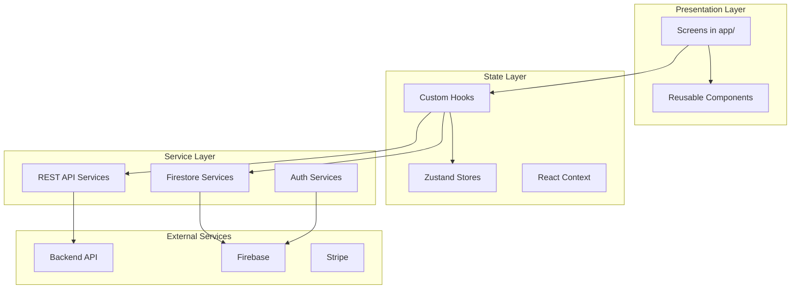
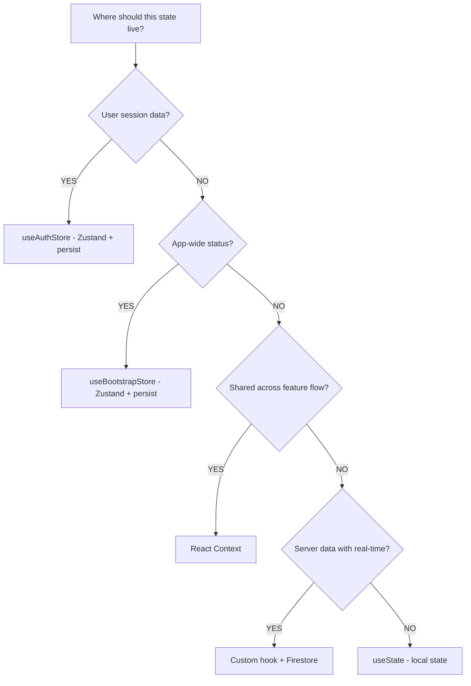
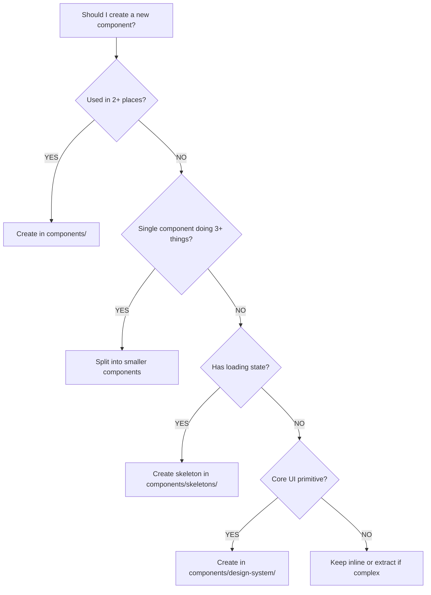
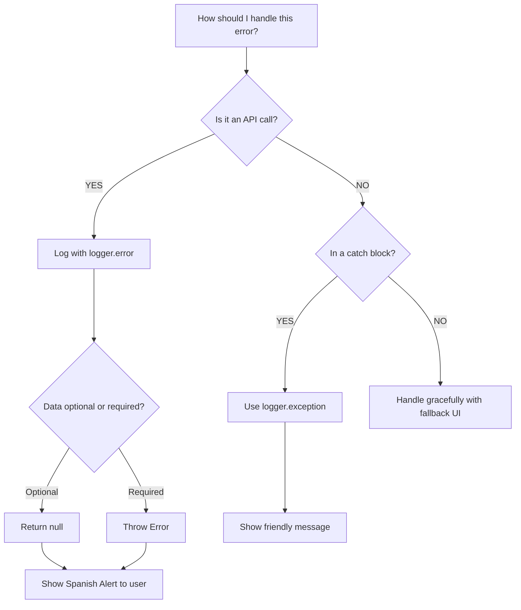
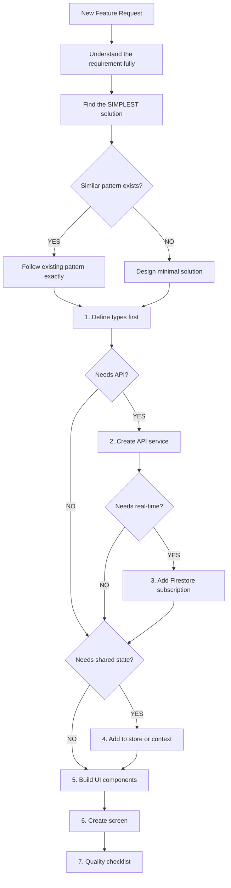

# Carpil AI Feature Guide

> Complete reference for AI-assisted development in the Carpil React Native application.

---

## Table of Contents

1. [Business Context](#1-business-context)
2. [Code Philosophy](#2-code-philosophy)
3. [Technology Stack](#3-technology-stack)
4. [Architecture](#4-architecture)
5. [Implementation Patterns](#5-implementation-patterns)
6. [Decision Framework](#6-decision-framework)
7. [Code Conventions](#7-code-conventions)
8. [Quality Checklist](#8-quality-checklist)
9. [Key Files Reference](#9-key-files-reference)
10. [Anti-Patterns](#10-anti-patterns)
11. [Debugging Guide](#11-debugging-guide)

---

## 1. Business Context

### Product Identity

| Aspect       | Details                                                          |
| ------------ | ---------------------------------------------------------------- |
| **Product**  | Carpil - Carpooling application                                  |
| **Mission**  | Connect drivers and passengers traveling to the same destination |
| **Market**   | Costa Rica                                                       |
| **Language** | Spanish (UI text)                                                |
| **Currency** | CRC (Costa Rican Colón) - displayed as ₡                         |
| **Timezone** | America/Costa_Rica                                               |

### Product Vision

Carpil focuses on the **user experience during the ride journey**. Every feature serves a purpose:

- **User Design/Experience**: How will the user feel?
- **Performance**: Is it fast and responsive?
- **Business Logic**: Does it support the core carpooling flow?

### Startup Mindset

- **Fast feedback loops**: Ship features quickly, learn from users
- **Purposeful code**: Every line serves UX, performance, or business needs
- **Simplicity over complexity**: Build for now, not hypothetical futures

### Core User Flows

```
Driver Flow:
Create Ride → Passengers Join → Start Ride → Navigate → Complete → Receive Payment → Rate Passengers

Passenger Flow:
Browse Rides → Reserve Seat → Join Chat → Meet at Point → Ride → Pay → Rate Driver
```

---

## 2. Code Philosophy

### The Three Principles

Based on [Refactoring Guru Code Smells](https://refactoring.guru/refactoring/smells):

#### Principle 1: Self-Documenting Code

**No comments unless absolutely necessary.** Code should speak for itself.

```typescript
// BAD: Needs comment to explain
const r = seats - p.length; // remaining seats

// GOOD: Self-explanatory
const remainingSeats = availableSeats - passengers.length;
```

Naming conventions:

- Functions describe actions: `handleJoinRide`, `fetchUserProfile`, `subscribeToRide`
- Variables reveal intent: `isDriver`, `pendingReviews`, `departureDate`
- Booleans are questions: `isLoading`, `hasProfilePicture`, `canStartRide`

#### Principle 2: Simplicity First

Before writing any code:

1. Understand the problem completely
2. Find multiple solutions
3. Choose the **simplest** one that works
4. If two solutions are equivalent, pick the one with less code

#### Principle 3: Prevent Code Smells

| Category              | What to Avoid                                                   |
| --------------------- | --------------------------------------------------------------- |
| **Bloaters**          | Functions over 30 lines, classes with too many responsibilities |
| **Dispensables**      | Dead code, duplicate code, lazy classes, excessive comments     |
| **Couplers**          | Feature envy, inappropriate intimacy between modules            |
| **Change Preventers** | Shotgun surgery (changes require edits in many places)          |

---

## 3. Technology Stack

### Core Framework

| Technology   | Version | Purpose                |
| ------------ | ------- | ---------------------- |
| Expo         | SDK 52  | React Native framework |
| React Native | 0.76.9  | Mobile UI framework    |
| TypeScript   | 5.3.3   | Type safety            |
| Expo Router  | 4.x     | File-based navigation  |

### State Management

| Technology    | Purpose                                  |
| ------------- | ---------------------------------------- |
| Zustand       | Global state (persisted to AsyncStorage) |
| React Context | Feature-specific shared state            |
| useState      | Component-local state                    |

### Backend Integration

| Technology           | Purpose                               |
| -------------------- | ------------------------------------- |
| Firebase Auth        | Authentication (Google, Apple, Email) |
| Firestore            | Real-time database subscriptions      |
| Firebase Crashlytics | Error reporting                       |
| REST API             | Backend communication (fetch-based)   |
| Sentry               | Error monitoring and performance      |

### UI & Features

| Technology            | Purpose                      |
| --------------------- | ---------------------------- |
| React Native Maps     | Map display and directions   |
| Stripe                | Payment processing           |
| Expo Notifications    | Push notifications           |
| react-hook-form + yup | Form handling and validation |
| @formkit/tempo        | Date formatting              |

---

## 4. Architecture

### Directory Structure

```
app/                          # Expo Router - File-based routing
├── _layout.tsx               # Root layout with providers
├── index.tsx                 # Entry redirect
├── (tabs)/                   # Tab navigator
│   ├── _layout.tsx           # Tab bar configuration
│   ├── index.tsx             # Home (rides list)
│   ├── messages.tsx          # Chats list
│   └── profile.tsx           # User profile
├── ride/
│   ├── _layout.tsx           # Stack layout
│   └── [id].tsx              # Dynamic ride details
├── chats/
│   └── [chatId].tsx          # Chat with real-time messages
├── create-ride/              # Multi-step flow
├── login/                    # Authentication screens
├── signup/                   # Registration
└── checkout/                 # Payment flow

components/                   # Reusable UI components
├── design-system/            # Core primitives
│   └── buttons/              # ActionButton, etc.
├── skeletons/                # Loading state components
│   ├── ride-card.tsx
│   ├── chat-card.tsx
│   └── shimmer.tsx
├── buttons/                  # Button variants
├── chats/                    # Chat-specific components
└── [feature].tsx             # Feature components (ride-card, avatar)

context/                      # React Context providers
├── notifications.tsx         # Push notification state
└── select-location.tsx       # Location selection state

hooks/                        # Custom React hooks
├── useBootstrap.ts           # App bootstrap state selector
├── useDriver.ts              # Driver check utility
├── useRealtimeRide.ts        # Real-time ride subscription
└── useRealtimeBootstrap.ts   # Real-time user state

services/                     # External communication
├── api/                      # REST API services
│   ├── auth.ts               # Authentication
│   ├── rides.ts              # Ride CRUD
│   ├── chats.ts              # Chat operations
│   ├── payments.ts           # Stripe integration
│   └── ride-request.ts       # Ride requests
├── auth/                     # Social auth
│   ├── google.ts
│   └── apple.ts
├── firestore/                # Real-time subscriptions
│   ├── config.ts             # Firestore instance
│   ├── rides.ts              # Ride subscriptions
│   └── user-state.ts         # User document subscription
└── push-notifications/       # Notification handling

store/                        # Zustand stores
├── useAuthStore.ts           # User + token (persisted)
└── useBootstrapStore.ts      # App state (persisted)

types/                        # TypeScript definitions
├── responses/                # API response types
├── requests/                 # API request types
├── form/                     # Form data types
├── ride.ts                   # Ride entity
├── user.ts                   # User entity
├── location.ts               # Location entity
└── message.ts                # Message entity

utils/                        # Utilities
├── constansts/               # Constants (note: typo in codebase)
│   ├── colors.ts             # COLORS object
│   └── api.ts                # API_URL
├── logs.ts                   # Logger utility
├── format-date.ts            # Date formatting
└── currency.ts               # Currency utilities
```

### Data Flow



---

## 5. Implementation Patterns

> **Note**: All patterns below are derived from actual implementations in the codebase.
> Reference the real files for the most up-to-date patterns.

### Real Implementation References

| Pattern                | Reference File                                                    | Key Lines                      |
| ---------------------- | ----------------------------------------------------------------- | ------------------------------ |
| API Service            | `services/api/rides.ts`                                           | getRides, createRide, joinRide |
| Real-time Hook         | `hooks/useRealtimeRide.ts`                                        | Full file                      |
| Firestore Subscription | `services/firestore/rides.ts`                                     | subscribeToRide                |
| Screen with States     | `app/ride/[id].tsx`                                               | Loading, error, success states |
| Form Validation        | `app/signup/index.tsx`                                            | yup schema, react-hook-form    |
| Zustand Store          | `store/useAuthStore.ts`                                           | Persisted state pattern        |
| Component + Skeleton   | `components/ride-card.tsx` + `components/skeletons/ride-card.tsx` |
| List with Refresh      | `components/rides-list.tsx`                                       | FlatList with pull-to-refresh  |

### Pattern A: API Service Function

Location: `services/api/`

```typescript
import { API_URL } from "@utils/constansts/api";
import { useAuthStore } from "store/useAuthStore";
import { logger } from "@utils/logs";
import { EntityResponse } from "~types/responses/entity";

export const getEntityById = async (id: string) => {
  const token = useAuthStore.getState().token;
  const response = await fetch(`${API_URL}/entities/${id}`, {
    headers: {
      Authorization: `Bearer ${token}`,
      "Content-Type": "application/json",
    },
  });

  if (!response.ok) {
    logger.error("Failed to fetch entity", {
      action: "get_entity_failed",
      metadata: { status: response.status, entityId: id },
    });
    return null;
  }

  const data = (await response.json()) as EntityResponse;

  logger.info("Entity fetched successfully", {
    action: "get_entity_success",
    metadata: { entityId: id },
  });

  return data.entity;
};
```

Key elements:

- Get token from Zustand store
- Include Authorization header
- Log errors with action name and metadata
- Log success with relevant metadata
- Return null on failure (or throw for required data)
- Type the response properly

### Pattern B: Real-time Subscription Hook

Location: `hooks/`

```typescript
import { useEffect, useState } from "react";
import { Entity } from "~types/entity";
import { subscribeToEntity } from "services/firestore/entities";
import { getEntity } from "services/api/entities";

export const useRealtimeEntity = (entityId: string) => {
  const [entity, setEntity] = useState<Entity | null>(null);
  const [loading, setLoading] = useState(true);
  const [error, setError] = useState<string | null>(null);

  useEffect(() => {
    let unsubscribe: (() => void) | null = null;

    const setupRealtimeUpdates = async () => {
      try {
        setLoading(true);
        setError(null);

        // Fetch initial data from API
        const initialEntity = await getEntity(entityId);
        if (initialEntity) {
          setEntity(initialEntity);
        }

        // Subscribe to real-time updates
        unsubscribe = subscribeToEntity(
          entityId,
          (updatedEntity) => {
            if (updatedEntity) {
              setEntity(updatedEntity);
              setError(null);
            } else {
              setError("Entity not found");
            }
            setLoading(false);
          },
          (error) => {
            setError("Real-time connection error");
            setLoading(false);
          }
        );
      } catch (err) {
        setError("Failed to load entity");
        setLoading(false);
      }
    };

    setupRealtimeUpdates();

    return () => {
      if (unsubscribe) {
        unsubscribe();
      }
    };
  }, [entityId]);

  return { entity, loading, error };
};
```

Key elements:

- Manage loading, error, and data states
- Fetch initial data from API
- Subscribe to Firestore for real-time updates
- Clean up subscription on unmount
- Handle both success and error cases

### Pattern C: Firestore Subscription Service

Location: `services/firestore/`

```typescript
import { doc, onSnapshot, Unsubscribe } from "@react-native-firebase/firestore";
import { Entity } from "~types/entity";
import FirestoreConfig from "./config";

export const subscribeToEntity = (
  entityId: string,
  onUpdate: (entity: Entity | null) => void,
  onError?: (error: Error) => void
): Unsubscribe => {
  const db = FirestoreConfig.getDb();
  const entityRef = doc(db, "entities", entityId);

  return onSnapshot(
    entityRef,
    (snapshot) => {
      if (snapshot.exists) {
        const data = snapshot.data();
        if (data) {
          const entity: Entity = {
            id: snapshot.id,
            ...data,
            // Convert Firestore timestamps to Date
            createdAt: data.createdAt?.toDate() || new Date(),
          } as Entity;
          onUpdate(entity);
        } else {
          onUpdate(null);
        }
      } else {
        onUpdate(null);
      }
    },
    (error) => {
      onError?.(error);
    }
  );
};
```

### Pattern D: Screen with States

Location: `app/`

```typescript
import { View, Text, ActivityIndicator, ScrollView } from 'react-native'
import { useLocalSearchParams } from 'expo-router'
import Screen from '@components/screen'
import { COLORS } from '@utils/constansts/colors'
import { useRealtimeEntity } from 'hooks/useRealtimeEntity'

export default function EntityDetails() {
  const { id } = useLocalSearchParams()
  const { entity, loading, error } = useRealtimeEntity(id as string)

  if (loading) {
    return (
      <Screen>
        <View style={styles.loadingContainer}>
          <ActivityIndicator size="large" color={COLORS.primary} />
          <Text style={styles.loadingText}>Cargando...</Text>
        </View>
      </Screen>
    )
  }

  if (error || !entity) {
    return (
      <Screen>
        <View style={styles.errorContainer}>
          <Text style={styles.errorIcon}>🔍</Text>
          <Text style={styles.errorTitle}>No encontrado</Text>
          <Text style={styles.errorMessage}>
            {error || 'El contenido no está disponible.'}
          </Text>
        </View>
      </Screen>
    )
  }

  return (
    <Screen>
      <ScrollView>
        {/* Main content */}
      </ScrollView>
    </Screen>
  )
}
```

Key elements:

- Get dynamic route params with `useLocalSearchParams`
- Handle loading state with ActivityIndicator
- Handle error state with user-friendly Spanish message
- Use Screen wrapper for consistent layout

### Pattern E: Form with Validation

Location: `app/`

```typescript
import { useForm, Controller } from 'react-hook-form'
import { yupResolver } from '@hookform/resolvers/yup'
import * as yup from 'yup'
import { TextInput, View, Text } from 'react-native'
import { COLORS } from '@utils/constansts/colors'
import PrimaryButton from '@components/buttons/primary'

interface FormData {
  fieldName: string
  email: string
}

const schema = yup.object().shape({
  fieldName: yup
    .string()
    .required('Campo requerido')
    .min(2, 'Mínimo 2 caracteres'),
  email: yup
    .string()
    .email('Correo inválido')
    .required('Correo requerido'),
})

export default function FormScreen() {
  const {
    control,
    handleSubmit,
    formState: { errors },
  } = useForm<FormData>({
    resolver: yupResolver(schema),
    defaultValues: {
      fieldName: '',
      email: '',
    },
  })

  const onSubmit = async (data: FormData) => {
    // Handle form submission
  }

  return (
    <View>
      <Controller
        control={control}
        name="fieldName"
        render={({ field: { onChange, value } }) => (
          <View>
            <TextInput
              style={[styles.input, errors.fieldName && styles.errorInput]}
              placeholder="Nombre del campo"
              placeholderTextColor={COLORS.border_gray}
              value={value}
              onChangeText={onChange}
            />
            {errors.fieldName && (
              <Text style={styles.errorText}>{errors.fieldName.message}</Text>
            )}
          </View>
        )}
      />
      <PrimaryButton text="Enviar" onPress={handleSubmit(onSubmit)} />
    </View>
  )
}
```

### Pattern F: Zustand Store

Location: `store/`

```typescript
import { create } from "zustand";
import AsyncStorage from "@react-native-async-storage/async-storage";
import { persist } from "zustand/middleware";

interface EntityState {
  entity: Entity | null;
  setEntity: (entity: Entity) => void;
  clearEntity: () => void;
}

export const useEntityStore = create<EntityState>()(
  persist(
    (set) => ({
      entity: null,
      setEntity: (entity) => set({ entity }),
      clearEntity: () => set({ entity: null }),
    }),
    {
      name: "entity-storage",
      storage: {
        getItem: async (name) => {
          const value = await AsyncStorage.getItem(name);
          return value ? JSON.parse(value) : null;
        },
        setItem: async (name, value) => {
          await AsyncStorage.setItem(name, JSON.stringify(value));
        },
        removeItem: async (name) => {
          await AsyncStorage.removeItem(name);
        },
      },
    }
  )
);
```

### Pattern G: Component with Skeleton

Create both the component and its skeleton:

```typescript
// components/entity-card.tsx
import { View, Text, Pressable, StyleSheet } from 'react-native'
import { Link } from 'expo-router'
import { COLORS } from '@utils/constansts/colors'
import { Entity } from '~types/entity'

interface EntityCardProps {
  entity: Entity
}

export default function EntityCard({ entity }: EntityCardProps) {
  return (
    <Link href={`/entity/${entity.id}`} asChild>
      <Pressable
        style={({ pressed }) => [
          styles.card,
          pressed && styles.cardPressed,
        ]}
      >
        <Text style={styles.title}>{entity.name}</Text>
      </Pressable>
    </Link>
  )
}

const styles = StyleSheet.create({
  card: {
    backgroundColor: COLORS.inactive_gray,
    borderRadius: 8,
    padding: 16,
    borderWidth: 1,
    borderColor: COLORS.border_gray,
    marginBottom: 8,
  },
  cardPressed: {
    backgroundColor: COLORS.border_gray,
  },
  title: {
    color: COLORS.white,
    fontSize: 16,
    fontWeight: 'bold',
  },
})
```

```typescript
// components/skeletons/entity-card.tsx
import { View, StyleSheet } from 'react-native'
import { COLORS } from '@utils/constansts/colors'
import { Shimmer } from './shimmer'

export default function EntityCardSkeleton() {
  return (
    <View style={styles.card}>
      <Shimmer>
        <View style={styles.titleSkeleton} />
      </Shimmer>
    </View>
  )
}

const styles = StyleSheet.create({
  card: {
    backgroundColor: COLORS.inactive_gray,
    borderRadius: 8,
    padding: 16,
    borderWidth: 1,
    borderColor: COLORS.border_gray,
    marginBottom: 8,
  },
  titleSkeleton: {
    width: 150,
    height: 16,
    backgroundColor: COLORS.gray_400,
    borderRadius: 4,
  },
})
```

---

## 6. Decision Framework

### State Management Decision Tree



**Text version:**

```
Where should this state live?

Is it user session data (user, token)?
└── YES → useAuthStore (Zustand + persist)

Is it app-wide status (current ride, pending reviews)?
└── YES → useBootstrapStore (Zustand + persist)

Is it shared across a feature flow (location selection)?
└── YES → React Context

Is it server data needing real-time updates?
└── YES → Custom hook with Firestore subscription

Is it only used in this component?
└── YES → useState
```

### State Management Quick Reference

| Scenario                   | Solution                | Example                 |
| -------------------------- | ----------------------- | ----------------------- |
| User session (persisted)   | Zustand + AsyncStorage  | `useAuthStore`          |
| App-wide state (persisted) | Zustand + AsyncStorage  | `useBootstrapStore`     |
| Multi-screen feature state | React Context           | `SelectLocationContext` |
| Real-time server data      | Custom hook + Firestore | `useRealtimeRide`       |
| Component UI state         | useState                | Form inputs, toggles    |

### Component Creation Decision



**Text version:**

```
Should I create a new component?

Is it used in 2+ places?
└── YES → Create in components/

Is a single component doing 3+ things?
└── YES → Split into smaller components

Does it have a loading state?
└── YES → Create matching skeleton in components/skeletons/

Is it a core UI primitive (button, input)?
└── YES → Create in components/design-system/
```

### Error Handling Decision



**Text version:**

```
How should I handle this error?

Is it an API call?
├── Log with logger.error({ action, metadata })
├── Return null (optional data) OR throw (required data)
└── Show Spanish user message via Alert

Is it in a catch block?
├── Use logger.exception(error, { action, metadata })
└── Show friendly message: "Ocurrió un error"

Never expose technical errors to users.
```

### New Feature Decision Flow



---

## 7. Code Conventions

### Import Aliases

Configured in `tsconfig.json`:

```typescript
// Components
import Component from "@components/component-name";

// Utilities
import { COLORS } from "@utils/constansts/colors";
import { logger } from "@utils/logs";

// Types
import { Entity } from "~types/entity";

// Context
import { useContext } from "@context/context-name";
```

### Naming Conventions

| Type             | Convention                     | Example                              |
| ---------------- | ------------------------------ | ------------------------------------ |
| Components       | PascalCase                     | `RideCard`, `SafeScreen`             |
| Hooks            | camelCase with "use" prefix    | `useRealtimeRide`, `useDriver`       |
| API functions    | camelCase verb+noun            | `getRides`, `createRide`, `joinRide` |
| Types/Interfaces | PascalCase                     | `Ride`, `User`, `RideResponse`       |
| Constants        | SCREAMING_SNAKE_CASE           | `API_URL`, `COLORS`                  |
| Store hooks      | camelCase with "use" + "Store" | `useAuthStore`                       |

### File Naming

| Type       | Convention                    | Example                 |
| ---------- | ----------------------------- | ----------------------- |
| Components | kebab-case.tsx                | `ride-card.tsx`         |
| Screens    | kebab-case.tsx or [param].tsx | `index.tsx`, `[id].tsx` |
| Hooks      | camelCase.ts                  | `useRealtimeRide.ts`    |
| Types      | kebab-case.ts                 | `ride-request.ts`       |
| Services   | kebab-case.ts                 | `ride-request.ts`       |

### Styling Pattern

Always use StyleSheet and COLORS:

```typescript
import { StyleSheet } from "react-native";
import { COLORS } from "@utils/constansts/colors";

const styles = StyleSheet.create({
  container: {
    flex: 1,
    backgroundColor: COLORS.primary,
    padding: 12,
  },
  title: {
    color: COLORS.white,
    fontSize: 24,
    fontWeight: "bold",
  },
  subtitle: {
    color: COLORS.gray_400,
    fontSize: 14,
  },
});
```

### Color Palette

```typescript
COLORS = {
  primary: "#6F52EA", // Purple - main brand color
  primary_dark: "#5643C5", // Darker purple - pressed states
  secondary: "#2AADAD", // Teal - secondary actions
  secondary_dark: "#18C5C5", // Darker teal

  dark_gray: "#111827", // Background dark
  inactive_gray: "#1F2937", // Card backgrounds
  light_gray: "#1F2937", // Same as inactive
  border_gray: "#374151", // Borders
  gray_400: "#9CA3AF", // Subtle text
  gray_600: "#4B5563", // Disabled states

  white: "#FFFFFF",
  white_gray: "#D1D5DB",
  black: "#000000",

  star_yellow: "#F59E0B", // Rating stars
};
```

### Date Formatting

Always use the utility with Costa Rica timezone:

```typescript
import { formatDate } from "@utils/format-date";

const { hour, date, dateText } = formatDate(departureDate);
// hour: "10:30 AM"
// date: "1/15/24" (short format)
// dateText: "15 ene 2024"
```

### Logging Pattern

```typescript
import { logger } from "@utils/logs";

// Info logging
logger.info("Action completed", {
  action: "action_name_success",
  metadata: { entityId: id, count: items.length },
});

// Error logging
logger.error("Action failed", {
  action: "action_name_failed",
  metadata: { status: response.status, entityId: id },
});

// Exception logging (in catch blocks)
logger.exception(error, {
  action: "action_name_error",
  metadata: { context: "additional info" },
});
```

---

## 8. Quality Checklist

Before completing ANY feature or bug fix, verify:

### Type Safety

- [ ] All new code is fully typed
- [ ] No `any` types (unless absolutely unavoidable)
- [ ] API responses have defined types in `types/responses/`
- [ ] Function parameters and returns are typed

### User Experience

- [ ] Loading states show ActivityIndicator or skeleton
- [ ] Error states show user-friendly Spanish messages
- [ ] Success feedback provided (Alert or navigation)
- [ ] Pressable elements have pressed state styling

### Code Quality

- [ ] Functions are under 30 lines
- [ ] No duplicate code
- [ ] No dead code
- [ ] Self-documenting names (no comments needed)
- [ ] Follows existing codebase patterns

### Logging & Debugging

- [ ] Key actions logged with `logger.info`
- [ ] Errors logged with `logger.error`
- [ ] Exceptions caught with `logger.exception`
- [ ] Action names follow pattern: `entity_action_result`

### Patterns

- [ ] API calls follow service pattern
- [ ] State management uses appropriate solution
- [ ] Components use COLORS constant
- [ ] Screens use Screen or SafeScreen wrapper

### Simplicity Check

- [ ] Is this the simplest solution?
- [ ] Can any code be removed?
- [ ] Are there unnecessary abstractions?

---

## 9. Key Files Reference

### Configuration Files

| File            | Purpose                               |
| --------------- | ------------------------------------- |
| `app.config.ts` | Expo configuration, API keys, plugins |
| `tsconfig.json` | TypeScript config with path aliases   |
| `package.json`  | Dependencies and scripts              |
| `env.d.ts`      | Environment variable types            |

### Core Utilities

| File                         | Purpose         | Usage                         |
| ---------------------------- | --------------- | ----------------------------- |
| `utils/constansts/colors.ts` | Color palette   | `COLORS.primary`              |
| `utils/constansts/api.ts`    | API base URL    | `API_URL`                     |
| `utils/logs.ts`              | Logger utility  | `logger.info/error/exception` |
| `utils/format-date.ts`       | Date formatting | `formatDate(date)`            |

### State Stores

| File                         | Purpose      | Key Exports                          |
| ---------------------------- | ------------ | ------------------------------------ |
| `store/useAuthStore.ts`      | User session | `user`, `token`, `login`, `logout`   |
| `store/useBootstrapStore.ts` | App state    | `rideId`, `inRide`, `pendingReviews` |

### Screen Wrappers

| Component    | Purpose           | When to Use                            |
| ------------ | ----------------- | -------------------------------------- |
| `Screen`     | Basic wrapper     | Simple screens with colored background |
| `SafeScreen` | Safe area wrapper | Screens needing safe area insets       |

SafeScreen props:

- `backgroundColor`: Background color (default: COLORS.primary)
- `applyTopInset`: Apply top safe area (default: true)
- `applyBottomInset`: Apply bottom safe area (default: false)
- `keyboardAware`: Wrap in KeyboardAwareScrollView (default: false)

### Type Definitions

| File                    | Contains                                 |
| ----------------------- | ---------------------------------------- |
| `types/user.ts`         | User, UserInfo, UserInfoResponse         |
| `types/ride.ts`         | Ride                                     |
| `types/location.ts`     | Location                                 |
| `types/message.ts`      | Message, FirestoreMessage, MessageBubble |
| `types/ride-request.ts` | RideRequest, RideRequestStatus           |
| `types/responses/*.ts`  | API response types                       |

---

## 10. Anti-Patterns

### Never Do These

| Anti-Pattern                 | Why                       | Do Instead                        |
| ---------------------------- | ------------------------- | --------------------------------- |
| `console.log()`              | Not tracked in production | Use `logger.info/error`           |
| Hardcoded colors             | Inconsistent UI           | Use `COLORS.colorName`            |
| Skip error handling          | Bad UX, hard to debug     | Always handle failures gracefully |
| Business logic in components | Hard to test/maintain     | Keep in services/hooks            |
| Duplicate API patterns       | Maintenance nightmare     | Follow existing service structure |
| Skip TypeScript types        | Runtime errors            | Define types in `types/`          |
| Comments explaining code     | Code smell                | Use better naming                 |
| Magic numbers/strings        | Unclear meaning           | Extract to constants              |
| Nested ternaries             | Unreadable                | Use if/else or early returns      |
| Over-engineering             | Wasted time               | Build for current needs only      |

### Code Smell Examples

```typescript
// BAD: Long function
const handleComplexOperation = async () => {
  // 50+ lines of code doing multiple things
};

// GOOD: Split into focused functions
const validateInput = (data: InputData) => {
  /* ... */
};
const processData = async (data: ValidData) => {
  /* ... */
};
const saveResult = async (result: Result) => {
  /* ... */
};

const handleOperation = async (data: InputData) => {
  const validated = validateInput(data);
  const processed = await processData(validated);
  await saveResult(processed);
};
```

```typescript
// BAD: Magic numbers
if (passengers.length >= 4) {
  /* ... */
}

// GOOD: Named constant
const MAX_PASSENGERS = 4;
if (passengers.length >= MAX_PASSENGERS) {
  /* ... */
}
```

```typescript
// BAD: Duplicate code
const fetchRides = async () => {
  const token = useAuthStore.getState().token;
  const response = await fetch(`${API_URL}/rides`, {
    headers: { Authorization: `Bearer ${token}` },
  });
  // ...
};

const fetchChats = async () => {
  const token = useAuthStore.getState().token;
  const response = await fetch(`${API_URL}/chats`, {
    headers: { Authorization: `Bearer ${token}` },
  });
  // ...
};

// GOOD: Follows established pattern in services/api/
// Each service function uses the same structure
```

---

## 11. Debugging Guide

### Common Issues

| Symptom                     | Likely Cause                 | Solution                                        |
| --------------------------- | ---------------------------- | ----------------------------------------------- |
| API returns null            | Token expired or missing     | Check `useAuthStore.getState().token`           |
| Firestore permission denied | User not authenticated       | Verify `auth().currentUser` exists              |
| Screen not rendering        | Wrong route file location    | Check Expo Router file structure                |
| State not updating          | Incorrect Zustand selector   | Use proper selector: `useStore((s) => s.value)` |
| Real-time not working       | Missing subscription cleanup | Ensure `unsubscribe()` in useEffect cleanup     |
| Form not submitting         | Validation errors            | Check yup schema and error messages             |

### Debugging Checklist

1. **Check the logs**: Look for `logger.error` output in console
2. **Verify authentication**: Is `useAuthStore.getState().token` present?
3. **Check network**: Is the API responding? Check status codes
4. **Verify types**: Are you handling all cases (null, undefined)?
5. **Check Firestore rules**: Do security rules allow the operation?

### Useful Debug Commands

```bash
# Start development server
yarn start

# Run on iOS
yarn ios

# Run on Android
yarn android

# Clean and rebuild
npx expo prebuild --clean
```

---

## Appendix: Feature Implementation Checklist

When building a new feature, follow this order:

### 1. Types First

- [ ] Define entity types in `types/`
- [ ] Define API response types in `types/responses/`
- [ ] Define request types if needed in `types/requests/`

### 2. API Service

- [ ] Create service function in `services/api/`
- [ ] Follow existing pattern with logger integration
- [ ] Handle errors and return appropriate values

### 3. Real-time (if needed)

- [ ] Create Firestore subscription in `services/firestore/`
- [ ] Create custom hook in `hooks/`

### 4. State (if needed)

- [ ] Add to existing Zustand store OR
- [ ] Create new Context provider

### 5. UI Components

- [ ] Create reusable components in `components/`
- [ ] Create skeleton components for loading states
- [ ] Use COLORS and StyleSheet

### 6. Screen

- [ ] Create screen in `app/` following route structure
- [ ] Handle loading, error, and success states
- [ ] Use appropriate screen wrapper

### 7. Quality Check

- [ ] Run through Quality Checklist (Section 8)
- [ ] Test on iOS and Android
- [ ] Verify Spanish text is correct

---

## Appendix B: Real Code Examples from Codebase

### Example 1: API Service Pattern

From `services/api/rides.ts` - How to fetch data from API:

```typescript
// Pattern: API GET request with authentication and logging
export const getRides = async () => {
  const response = await fetch(`${API_URL}/rides/drivers`, {
    headers: {
      "Content-Type": "application/json",
    },
  });
  if (!response.ok) {
    logger.error("Failed to fetch rides", {
      action: "get_rides_failed",
      metadata: { status: response.status },
    });
    return [];
  }
  const data = (await response.json()) as RidesResponse;
  logger.info("Rides fetched successfully", {
    action: "get_rides_success",
    metadata: { count: data.rides.length },
  });
  return data.rides;
};
```

### Example 2: Real-time Hook Pattern

From `hooks/useRealtimeRide.ts` - Combining API + Firestore:

```typescript
export const useRealtimeRide = (rideId: string) => {
  const [ride, setRide] = useState<Ride | null>(null);
  const [loading, setLoading] = useState(true);
  const [error, setError] = useState<string | null>(null);

  useEffect(() => {
    let unsubscribe: (() => void) | null = null;

    const setupRealtimeUpdates = async () => {
      // 1. Fetch initial data from REST API
      const initialRide = await getRide(rideId);
      if (initialRide) setRide(initialRide);

      // 2. Subscribe to Firestore for real-time updates
      unsubscribe = subscribeToRide(
        rideId,
        (updatedRide) => {
          setRide(updatedRide);
          setLoading(false);
        },
        (error) => {
          setError("Error de conexión");
          setLoading(false);
        }
      );
    };

    setupRealtimeUpdates();
    return () => {
      if (unsubscribe) unsubscribe();
    };
  }, [rideId]);

  return { ride, loading, error };
};
```

### Example 3: List Component Pattern

From `components/rides-list.tsx` - FlatList with loading, refresh, and empty states:

```typescript
export default function RidesList() {
  const [rides, setRides] = useState<Ride[]>([])
  const [loading, setLoading] = useState(true)
  const [refreshing, setRefreshing] = useState(false)

  // Initial load
  useEffect(() => { fetchRides() }, [])

  // Refresh on focus
  useFocusEffect(
    useCallback(() => {
      if (rides.length > 0) fetchRides(true)
    }, [rides.length]),
  )

  if (loading) {
    return (
      <FlatList
        data={Array.from({ length: 5 })}
        renderItem={() => <RideCardSkeleton />}
        keyExtractor={(_, index) => `skeleton-${index}`}
      />
    )
  }

  return (
    <FlatList
      data={rides}
      renderItem={({ item }) => <RideCard ride={item} />}
      keyExtractor={(item) => item.id}
      refreshControl={
        <RefreshControl refreshing={refreshing} onRefresh={onRefresh} />
      }
      ListEmptyComponent={renderEmpty}
    />
  )
}
```

### Example 4: Screen States Pattern

From `app/ride/[id].tsx` - Complete screen with all states:

```typescript
export default function RideDetails() {
  const { id } = useLocalSearchParams()
  const { ride, loading, error } = useRealtimeRide(id as string)

  // Loading state
  if (loading) {
    return (
      <Screen>
        <View style={styles.loadingContainer}>
          <ActivityIndicator size="large" color={COLORS.primary} />
          <Text style={styles.loadingText}>Cargando detalles del ride...</Text>
        </View>
      </Screen>
    )
  }

  // Error state
  if (error || !ride) {
    return (
      <Screen>
        <View style={styles.errorContainer}>
          <Text style={styles.errorIcon}>🚗</Text>
          <Text style={styles.errorTitle}>Ride no encontrado</Text>
          <Text style={styles.errorMessage}>
            {error || 'El ride no está disponible.'}
          </Text>
        </View>
      </Screen>
    )
  }

  // Success state
  return (
    <Screen>
      <ScrollView>
        {/* Content */}
      </ScrollView>
    </Screen>
  )
}
```

### Example 5: Form Validation Pattern

From `app/signup/index.tsx` - Complete form with yup:

```typescript
const signUpSchema = yup.object().shape({
  firstName: yup
    .string()
    .required("Nombre requerido")
    .min(2, "El nombre debe tener al menos 2 caracteres"),
  email: yup
    .string()
    .email("Correo electrónico inválido")
    .required("Correo electrónico requerido"),
  password: yup
    .string()
    .required("Contraseña requerida")
    .min(8, "La contraseña debe tener al menos 8 caracteres"),
});

const {
  control,
  handleSubmit,
  formState: { errors },
} = useForm<SignUpForm>({
  resolver: yupResolver(signUpSchema),
  defaultValues: { firstName: "", email: "", password: "" },
});
```

### Example 6: Zustand Store Pattern

From `store/useAuthStore.ts` - Persisted state:

```typescript
export const useAuthStore = create<AuthState>()(
  persist(
    (set) => ({
      user: null,
      token: null,
      login: (user, token) => set({ user, token }),
      logout: () => set({ user: null, token: null }),
    }),
    {
      name: "auth-storage",
      storage: {
        getItem: async (name) => {
          const value = await AsyncStorage.getItem(name);
          return value ? JSON.parse(value) : null;
        },
        setItem: async (name, value) => {
          await AsyncStorage.setItem(name, JSON.stringify(value));
        },
        removeItem: async (name) => {
          await AsyncStorage.removeItem(name);
        },
      },
    }
  )
);
```

### Example 7: Type Definitions Pattern

From `types/ride.ts` and `types/responses/rides.ts`:

```typescript
// Entity type
export type Ride = {
  id: string;
  origin: Location | null;
  destination: Location | null;
  meetingPoint: Location | null;
  availableSeats: number;
  price: number;
  departureDate: Date;
  passengers: User[];
  driver: User;
  status?: "active" | "canceled" | "completed";
  chatId: string;
};

// Response type
export interface RidesResponse {
  rides: Ride[];
}

export interface RideResponse {
  ride: Ride;
}
```

---

_Last updated: January 2025_
